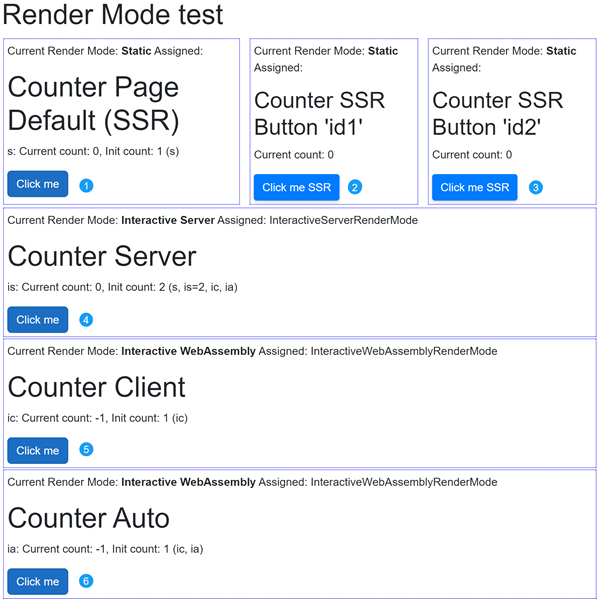
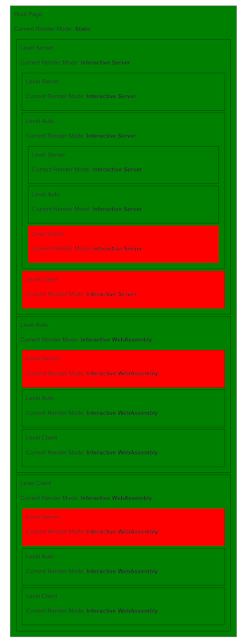

## Blazor .NET 8+ Examples: A Comprehensive Guide

### Overview

This repository complements the concepts covered in the "[Blazor for Developers](dev.md)" article by providing practical demonstrations of various render modes available in Blazor from .NET 8 onwards. Additionally, it explores two authentication approaches for .Net 9: one leveraging Microsoft Identity and the other using a custom authentication mechanism.

**Key Features:**

* **Hands-on Learning:** Experiment with different render modes (WebAssembly, Server-Side Rendering (SSR), and Hybrid) to understand their nuances and choose the best fit for your project.
* **Authentication Strategies:**  Explore securing your Blazor applications with both Microsoft Identity and custom mechanisms, giving you more flexibility.
* **Detailed Explanations:** Gain insights into the underlying concepts and rationale behind each approach, empowering informed decision-making.

**By exploring this repository, you'll be able to:**

* Bridge theory with practice: Apply the concepts from "[Blazor for Developers](dev.md)" article to build real Blazor applications.
* Make informed decisions about render modes and authentication approaches.
* Enhance your overall Blazor development skills with practical experience.


### Render Modes

Blazor .NET 8 introduces the concept of render modes, which determine where and how a component is rendered. This allows developers to optimize performance and user experience by choosing the appropriate mode for each component.

The available render modes are:

- **Static:** Component is pre-rendered on the server and delivered as static HTML. Suitable for SEO and initial page load performance.
- **Interactive Server:** Component is rendered on the server for each request. Great for interactive scenarios with server-side logic.
- **Interactive WebAssembly (WASM):** Component is downloaded and executed on the client side. Offers a more responsive user experience.
- **Auto:** Combines server-side rendering for initial request and client-side rendering for subsequent interactions. Offers a balance of performance and interactivity.

> **Note**: [additional info](https://github.com/AlexNek/Blazor-for-You/blob/master/ForManagers/net8ex.md)


## Solution Structure


The repository contains three primary project types, each demonstrating different aspects of Blazor development:

### 1, 2 - Authentication
1. **BlazorAuthentication:** A custom authentication implementation using cookies, showcasing a hands-on approach to securing Blazor applications in .NET 9. Primary target - render mode troubles and user info transfer between server and client.
2. **BlazorAuthenticationV2:** A Microsoft Identity-based authentication solution, leveraging a robust and secure  identity provider for .NET 9 applications (.NET 9).

### 3 - Render Modes
Two projects demonstrates the various render modes available in Blazor .NET 8+, showcasing how different components can be rendered using different modes within the same application.
There is only difference that one project written in .NET 8.0 and use render mode detection service. The second project written in .NET 9.0 and use default render mode detection.

#### Features

- **Rendering Modes**: Demonstrates Static Server-Side Rendering (SSR), Interactive Server, Interactive WebAssembly, and Interactive Auto render modes.
- **Counter Examples**: Includes examples of counters utilizing various render modes.
- **Mixed Render Modes**: Showcases how to integrate multiple render modes within a single page.
- **Singleton Service**: Illustrates the use of singleton service declarations on both the server and client sides.
- **Initialization Calls**: Demonstrates the `OnInitialAsync` calling count.
- **Mode Transitions**: Provides a navigation menu to explore different render mode scenarios.


The main pages of this examples are:

1. **Home Page**: Demonstrates multiple render modes on a single page
2. **Counter Page Auto Mode**: Example of Interactive Auto render mode
3. **Counter Page Client Mode**: Example of Interactive WebAssembly render mode
4. **Counter Page Server Mode**: Example of Interactive Server render mode
5. **Counter Form Page SSR**: Example of Static Server-Side Rendering
6. **Weather Page**: Additional example page to explore data fetching.
7. **Rended modes in Hierarchy**: Show all possible combination of render mode in green and not allowed in red.


## Getting Started

1. Clone this repository.
2. Open the solution in your preferred IDE (e.g., Visual Studio, Visual Studio Code).
3. Select as main one of render mode project.
4. Build and Run the application (Ctrl + F5 or F5).

### Home page observation
Explore the different components and render modes showcased in the `Home` page. The home page includes several Counter components, each potentially with a different render mode. Each component has an id and `Init count` tells how many times OnInitialAsync was called and which components id was called. Counter service on server have current count intially 0, and services on client initially -1.


Try to refresh the page and observe how render mode are changed for each counter component. You can see that first mode will be Static Server-Side Rendering (SSR) and then components will be switched to desired render mode.
Try to click counter button for components 1,4,5,6. You can see that button press will only work in interactive components without page refresh. Note that the counter initialization is called twice in interactive server mode: once during prerendering with InteractiveAuto and Interactive Client together, and once by interaction start. Wasm counters are used after prerendering client services, not server services, that is why init count is one.
When you change Current count by pressing the button `Click me` you can see that Server counter service preserve his state but client counter service initialized again.

It is possible to simulate button press in SSR mode too. You can see that two different counters (2,3) could be changed independely with page refresh.

>** Note:** Be aware that `OnInitialAsync' is called twice by interactive components. Use cache or render mode checking to prevent possible duplicate API calls.

### Counter page mode transition observation
More interesting is when you switch pages from one rendering mode to another.  

Try to switch 2->1 and 3->1. You can see that component with auto render mode still renders in the previous rendering mode, client or server, and not as you might expect in client mode only.

#### Interactive Auto render mode

Interactive Auto render mode in Blazor .NET 8+ works as follows:

1. Initial render: The component is first rendered using InteractiveServer mode, providing immediate interactivity via a WebSocket connection.

2. Background loading: While the component is interactive on the server, the .NET runtime and app bundle for WebAssembly are downloaded and cached client-side.

3. Subsequent renders: On future visits or page reloads, the component will use InteractiveWebAssembly mode, rendering on the client using the cached WebAssembly resources.

Key points to note:

- The render mode doesn't change dynamically for an already rendered component. It sticks with the initially chosen mode (Server or WebAssembly) until the component is reloaded or used elsewhere in the app.

- Auto mode tries to match the interactivity type of existing components on the page to avoid introducing a new runtime that doesn't share state.

- Prerendering is enabled by default, which can affect the perceived behavior of InteractiveAuto mode.

This behavior aims to provide a balance between immediate interactivity and improved performance on subsequent visits, but it may not always meet expectations, especially in development or testing scenarios.

### Render mode Hierachy
Select additional menu item for render mode hierarchy. 
Here is the table of possible hierarchy combination:

|From\To | SSR | Auto | Server | Client |
|--------|-----|------|--------|--------|
| SSR    | x | x | x | x |
| Auto   | - | x | ? | ? |
| Server | - | x | x | - |
| Client | - | x | - | x |

> Note 1: Question mark means that possibility depends from parent mode. 
> Note 2: In .NET 9.0 it is possible to switch to SSR mode from intractive mode but it working for complete page only, see: `@attribute [ExcludeFromInteractiveRouting]`

You can see that you can combine default SSR mode with any mode but after first selection you must stay on server or client side.


## Render mode limitations in Blazor

Choosing the correct render mode in Blazor can be challenging. Here's a breakdown of key component behaviors in Server-Side Rendering (SSR) and Interactive modes:

- HttpContext
  - SSR: Available. You can read/write cookies and access other HTTP context information.
  - Interactive: Not available. HttpContext is a server-side concept that does not exist in the interactive client-side rendering model. On server side after the initial rendering, the Blazor circuit operates over a SignalR connection, which does not carry the original HttpContext. Therefore, attempts to access it will yield null or lead to exceptions.
 > **Note**: Although you can use IHttpContextAccessor to access HttpContext, it is not recommended in Interactive Server mode because it does not guarantee that you will receive a valid HttpContext. 

- OnAfterRenderAsync
  - SSR (Static Server-Side Rendering): Not called.
  - Interactive (both Server and WebAssembly): Called after the component has rendered interactively and the UI has finished updating.

- JavaScript Interop
  - SSR: Limited functionality. Can't interact with the DOM or perform client-side operations.
  - Interactive: Fully functional. Allows for DOM manipulation and client-side scripting.

- NavigationManager
  - SSR: Limited functionality. Can't perform client-side navigation, but can access current URL.
  - Interactive: Fully functional. Supports client-side navigation and URL manipulation.
  > **Note**: From .NET 9.0, improved functionality in SSR mode. Can now perform server-side redirects.

- State Persistence
  - SSR: State is reset on each request.
  - Interactive: State persists between renders.

- Event Handling
  - SSR: Events are not triggered.
  - Interactive: Full event handling capabilities.

- RenderFragment
  - SSR: RenderFragment works as expected. It is rendered on the server and sent as static HTML to the client. But this means that any dynamic behavior or interactivity defined within the RenderFragment will not be functional until the client takes over rendering in an interactive mode.
  - Interactive: RenderFragment parameters (including ChildContent) cannot be used with interactive render modes set on the component level due to serialization limitations. However, they will work with page or application interactivity. This means that while RenderFragments can be used to define dynamic UI segments, their parameters must be carefully managed to ensure they are compatible with the render mode of the component or page.

> **Note 1:** Be aware that `OnInitialized...` could be called twice.

Understanding these limitations helps in designing components that work effectively across different render modes, ensuring optimal performance and functionality in Blazor applications.

### Navigation Manager .NET 9.0 changes

In .NET 9.0, NavigationManager.NavigateTo("/xxx", true) works in Server-Side Rendering (SSR) due to a change in behavior:

1. The forceLoad parameter (set to true) triggers a full page load, bypassing client-side routing.

2. This method now throws a NavigationException, which is intentionally used to end the current request and initiate a new one.

3. The exception is part of the navigation process and shouldn't be caught, allowing the navigation to occur.

This behavior differs from previous versions where NavigationManager had limited functionality in SSR. The change allows for server-side redirects in SSR scenarios, enhancing the flexibility of Blazor applications.

It's important to note that while this navigation works, it's still considered a server-side redirect rather than client-side navigation in SSR context.


## Custom authentication example

In this example I try to show some render mode limitations. From .NET 8.0 version we could create project with server and client sides and could switch rendering modes.


### User info serialization
As we want to security reason do all login operation on server we need to syncronize user authentification state between server and client.

- **For Server**

1. Implement the custom authentication state provider `PersistingRevalidatingAuthenticationStateProvider.cs`

 ```csharp
internal sealed class PersistingRevalidatingAuthenticationStateProvider : RevalidatingServerAuthenticationStateProvider
{
    private readonly PersistentComponentState _state;
  
    public PersistingRevalidatingAuthenticationStateProvider(ILoggerFactory loggerFactory,
    
    IServiceScopeFactory serviceScopeFactory,...): base(loggerFactory)
    {
      ...
      _state = persistentComponentState
      AuthenticationStateChanged += OnAuthenticationStateChanged;
      _subscription = _state.RegisterOnPersisting(OnPersistingAsync, RenderMode.InteractiveWebAssembly);
    }
  
    private async Task OnPersistingAsync()
    {
     ...
             _state.PersistAsJson(nameof(UserInfo), new UserInfo
             {
                 UserId = userId,
                 Email = email,
                 Name = name,
                 Roles = rolesStr
             });
     }
  }
 ```

2. Register the custom authentication state provider

 ```csharp
services.AddScoped<AuthenticationStateProvider, PersistingRevalidatingAuthenticationStateProvider>();
 ```

- **For Client**

1. Implement the custom authentication state provider `PersistentAuthenticationStateProvider.cs`

 ```csharp
internal class PersistentAuthenticationStateProvider : AuthenticationStateProvider
{
    private readonly Task<AuthenticationState> _authenticationStateTask = defaultUnauthenticatedTask;
  
    public PersistentAuthenticationStateProvider(PersistentComponentState state)
    {
     bool tryTakeSuccess = state.TryTakeFromJson<UserInfo>(nameof(UserInfo), out var userInfo);
     ...
      _authenticationStateTask = Task.FromResult(
        new AuthenticationState(new ClaimsPrincipal(new ClaimsIdentity(claims,
            authenticationType: nameof(PersistentAuthenticationStateProvider)))));
    }

    public override Task<AuthenticationState> GetAuthenticationStateAsync() => _authenticationStateTask;}
}
 ```

2. Register the custom authentication state provider
 ```csharp
services.AddSingleton<AuthenticationStateProvider, PersistentAuthenticationStateProvider>();
 ```

### Login Page

To utilize `HttpContext.SignInAsync` with the cookie authentication scheme, it's essential to operate in Server-Side Rendering (SSR) mode with form inputs. Pages that use SSR should be placed in the server-side project.

``` csharp
await HttpContext.SignInAsync(...);
Navigation.NavigateTo("/", true);
```

> **Note:** The second parameter in `NavigateTo("/", true)` is crucial. Setting `forceLoad` to `true` ensures a full page reload, which is necessary for saving the authentication cookie and updating the user's state on the client side.

### Logout Page

Implementing the logout functionality in the same manner as the login page is not advisable. Instead, you should create a dedicated logout endpoint to handle the sign-out process effectively. You can found full implementation in project `BlazorAuthentification` source code.

#### Incorrect Approach

Using `HttpContext.SignOutAsync` directly in the logout page like this is not recommended:

```csharp
await HttpContext.SignOutAsync(...);
Navigation.NavigateTo("/", true);
```
> Note: in the example I call it "logout over server"

#### Correct Approach

Instead, define a dedicated endpoint for logging out, which can be implemented as a minimal API:

```csharp
app.MapPost("/logout-endpoint", async (HttpContext httpContext, [FromForm] string? returnUrl) =>
{
    // Sign out the user
    await httpContext.SignOutAsync(CookieAuthenticationDefaults.AuthenticationScheme);
    
    // Redirect to the specified return URL or default to home
    return TypedResults.LocalRedirect($"~{returnUrl ?? "/"}");
});
```

#### Calling the Logout Endpoint

To trigger the logout process, use an HTML form that submits to this endpoint. Here’s an example:

```html
<form action="/logout-endpoint" method="post">
    <AntiforgeryToken />
    <input type="hidden" name="returnUrl" value="user-test-interactive" />
    <button type="submit" class="nav-link">
        <span class="bi bi-arrow-bar-left-nav-menu" aria-hidden="true"></span> Logout over endpoint
    </button>
</form>
```

#### Additional Example: Logging Out from the Client Side
To demonstrate how to log out from the client side, you can create a method that sends an HTTP POST request to your logout endpoint. Here’s an example implementation:
```csharp
private async Task LogoutHandler()
{
  ...
  var request = new HttpRequestMessage(HttpMethod.Post, "/logout-http");
  await httpClient.SendAsync(request);
  Navigation.NavigateTo("/", forceLoad: true);
}
```

### Render fragment example

- Working Example (WASM and SSR)
On the WASM and SSR pages, you can find a working RenderFragment example (1):


- Non-working Example (Interactive Page)
On the interactive page, the following RenderFragment example is commented out due to compatibility issues:  
```html
@* <RenderFragmentTest @rendermode="InteractiveAuto">
        <h1>Test Interactive Render Fragment</h1>
        <p>This is some content.</p>
</RenderFragmentTest> *@
```

#### Component source code:  
```html
<h3>RenderFragmentTest</h3>
<div>
    @ChildContent
</div>

@code {
    [Parameter]
    public RenderFragment? ChildContent { get; set; }
}
```

## Learn More

For more information on Blazor .NET 8 render modes, check out the following resources:

- [ASP.NET Core Blazor render modes](https://learn.microsoft.com/en-us/aspnet/core/blazor/components/render-modes?view=aspnetcore-8.0)
- [Blazor Basics: Blazor Render Modes in .NET 8](https://www.telerik.com/blogs/blazor-basics-blazor-render-modes-net-8)
- [Getting Started with Blazor’s New Render Modes in .NET 8](https://www.telerik.com/blogs/getting-started-blazor-new-render-modes-net-8)
- [Blazor Render Modes in .NET 8](https://dvoituron.com/2024/01/23/blazor-render-modes/)
- [Blazor 8 Render Mode Detection](https://blog.lhotka.net/2024/03/30/Blazor-8-Render-Mode-Detection)
- [Dealing With Blazor Prerendering](https://juliocasal.com/blog/dealing-with-blazor-prerendering)
- [Fetching and Sharing Data Between Components with Blazor’s Auto Render Mode](https://www.telerik.com/blogs/fetching-sharing-data-between-components-blazor-auto-render-mode)
- [ASP.NET Core Blazor authentication and authorization](https://learn.microsoft.com/en-us/aspnet/core/blazor/security/?view=aspnetcore-9.0&tabs=visual-studio#manage-authentication-state-in-blazor-web-apps)
- [Adopt simplified authentication state serialization for Blazor Web Apps](https://learn.microsoft.com/en-us/aspnet/core/migration/80-90?view=aspnetcore-9.0&tabs=visual-studio#adopt-simplified-authentication-state-serialization-for-blazor-web-apps)


