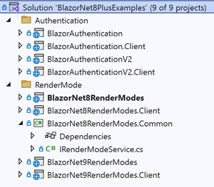
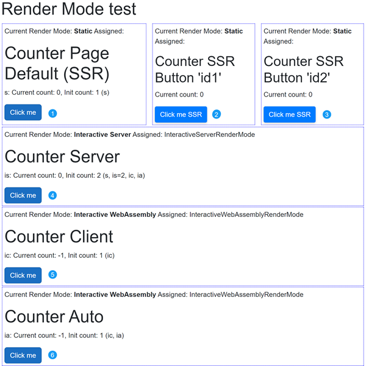
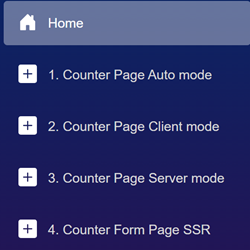
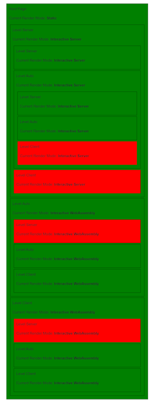
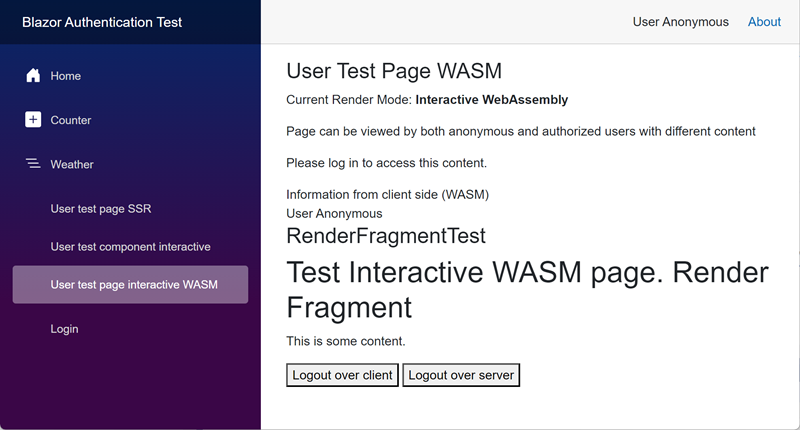
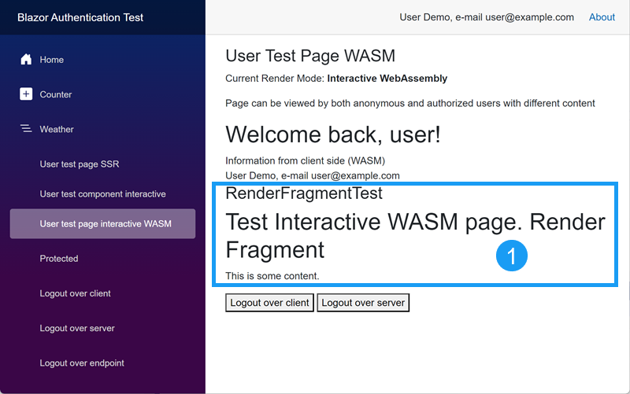

## Blazor .NET 8+ Beispiele: Ein umfassender Leitfaden
**[English Version](https://github.com/AlexNek/BlazorNet8PlusExamples/blob/master/README.md)**

### Überblick

Dieses Repository ergänzt die im Artikel "[Blazor für Entwickler](https://github.com/AlexNek/Blazor-for-You/blob/master/ForDevelopers/readme-de.md)" behandelten Konzepte durch praktische Demonstrationen der verschiedenen Render-Modi, die ab .NET 8 in Blazor verfügbar sind. Darüber hinaus werden zwei Authentifizierungsansätze für .Net 9 untersucht: ein Ansatz, der Microsoft Identity verwendet, und ein Ansatz, der einen eigenen Authentifizierungsmechanismus verwendet.

**Hauptmerkmale:**

- **Praktisches Lernen:** Experimentieren Sie mit verschiedenen Render-Modi (WebAssembly, Server-Side Rendering (SSR) und Hybrid), um deren Besonderheiten zu verstehen und den besten Ansatz für Ihr Projekt auszuwählen. [Demo 1](https://blazornet9rendermodes.azurewebsites.net) 
- **Authentifizierungsstrategien:** Erforschen Sie die Absicherung Ihrer Blazor-Anwendungen mit Microsoft Identity oder benutzerdefinierten Mechanismen für maximale Flexibilität. [Demo 2](https://blazorauthentication202412.azurewebsites.net)  
- **Detaillierte Erklärungen:** Verstehen Sie die zugrunde liegenden Konzepte und die Logik hinter jedem Ansatz, um fundierte Entscheidungen treffen zu können.  

**Durch die Erkundung dieses Repositories können Sie:**

- Theorie mit Praxis verbinden: Wenden Sie die im Artikel "[Blazor für Entwickler](https://github.com/AlexNek/Blazor-for-You/blob/master/ForDevelopers/readme-de.md)" vorgestellten Konzepte an, um echte Blazor-Anwendungen zu entwickeln.  
- Fundierte Entscheidungen zu Render-Modi und Authentifizierungsansätzen treffen.  
- Ihre Blazor-Entwicklungsfähigkeiten durch praktische Erfahrungen erweitern.  

### Render-Modi

Blazor .NET 8 führt das Konzept der Render-Modi ein, die festlegen, wo und wie eine Komponente gerendert wird. Dadurch können Entwickler die Leistung und Benutzererfahrung optimieren, indem sie für jede Komponente den passenden Modus auswählen.  

Die verfügbaren Render-Modi sind:  

- **Static:** Die Komponente wird auf dem Server vorgerendert und als statisches HTML ausgeliefert. Geeignet für SEO und die anfängliche Ladegeschwindigkeit der Seite.  
- **Interactive Server:** Die Komponente wird bei jeder Anfrage serverseitig gerendert. Ideal für interaktive Szenarien mit serverseitiger Logik.
- **Interactive WebAssembly (WASM):** Die Komponente wird heruntergeladen und clientseitig ausgeführt. Bietet eine reaktionsschnellere Benutzererfahrung.  
- **Auto:** Kombiniert serverseitiges Rendering für die erste Anfrage mit clientseitigem Rendering für weitere Interaktionen. Bietet eine ausgewogene Mischung aus Leistung und Interaktivität.  

> **Hinweis:** [Zusätzliche Informationen](https://github.com/AlexNek/Blazor-for-You/blob/master/ForManagers/net8ex-de.md)  

## Projektstruktur

  

Das Repository enthält drei Hauptprojekttypen, die unterschiedliche Aspekte der Blazor-Entwicklung demonstrieren:  

### 1, 2 – Authentifizierung  

1. **BlazorAuthentication:** Eine benutzerdefinierte Authentifizierungsimplementierung mithilfe von Cookies, die einen praktischen Ansatz zur Sicherung von Blazor-Anwendungen in .NET 9 zeigt. Der Schwerpunkt liegt auf Herausforderungen mit Render-Modi und der Übertragung von Benutzerdaten zwischen Server und Client.  
2. **BlazorAuthenticationV2:** Eine Authentifizierungslösung auf Basis von Microsoft Identity, die einen robusten und sicheren Identitätsanbieter für .NET 9 - Anwendungen nutzt.  

### 3 – Render-Modi  

Zwei Projekte demonstrieren die verschiedenen Render-Modi, die in Blazor .NET 8+ verfügbar sind. Sie zeigen, wie unterschiedliche Komponenten innerhalb derselben Anwendung mit verschiedenen Modi gerendert werden können:  
- Das erste Projekt wurde in .NET 8.0 geschrieben und verwendet einen Dienst zur Erkennung von Render-Modi.  
- Das zweite Projekt wurde in .NET 9.0 geschrieben und nutzt die standardmäßige Render-Modus-Erkennung.  

#### Funktionen

- **Render-Modi**: Demonstriert Static Server-Side Rendering (SSR), Interactive Server, Interactive WebAssembly und Interactive Auto Render-Modi.  
- **Counter-Beispiele**: Enthält Beispiele für Counter, die verschiedene Render-Modi verwenden.  
- **Gemischte Render-Modi**: Zeigt, wie mehrere Render-Modi auf einer einzigen Seite integriert werden können.  
- **Singleton-Service**: Veranschaulicht die Verwendung von Singleton-Service-Deklarationen sowohl auf Server- als auch auf Client-Seite.  
- **Initialisierungsaufrufe**: Demonstriert die Aufrufanzahl von `OnInitialAsync`.  
- **Modus-Übergänge**: Bietet ein Navigationsmenü, um verschiedene Szenarien der Render-Modi zu erkunden.  

Die Hauptseiten dieser Beispiele sind:  

1. **Startseite**: Demonstriert mehrere Render-Modi auf einer einzigen Seite.  
2. **Counter-Seite Auto-Modus**: Beispiel für den Interactive Auto Render-Modus.  
3. **Counter-Seite Client-Modus**: Beispiel für den Interactive WebAssembly Render-Modus.  
4. **Counter-Seite Server-Modus**: Beispiel für den Interactive Server Render-Modus.  
5. **Counter-Formular-Seite SSR**: Beispiel für Static Server-Side Rendering.  
6. **Wetter-Seite**: Zusätzliche Beispielseite zur Erkundung von Datenabfragen.  
7. **Render-Modi in Hierarchien**: Zeigt alle möglichen Kombinationen von Render-Modi in Grün und nicht erlaubte in Rot.  

## Erste Schritte

1. Klonen Sie dieses Repository.  
2. Öffnen Sie die `solution` in Ihrer bevorzugten IDE (z. B. Visual Studio, Visual Studio Code).  
3. Wählen Sie eines der Render-Modus-Projekte als Hauptprojekt aus.  
4. Bauen und starten Sie die Anwendung (Strg + F5 oder F5).  

### Beobachtung der Startseite  

Erkunden Sie die verschiedenen Komponenten und Darstellungsmodi, die auf der Startseite angezeigt werden. Die Startseite enthält mehrere Counter-Komponenten, von denen jede einen anderen Darstellungsmodus haben kann. Jede Komponente hat eine ID, und `Init count` zeigt an, wie oft `OnInitialAsync` aufgerufen wurde und welche Komponenten-ID betroffen war. Der Counter-Service auf dem Server startet mit einem aktuellen Wert von 0, während die Services auf dem Client mit einem initialen Wert von -1 beginnen.  

  

Versuchen Sie, die Seite zu aktualisieren, und beobachten Sie, wie sich der Render-Modus für jede Counter-Komponente ändert. Sie werden feststellen, dass der erste Modus Static Server-Side Rendering (SSR) ist und die Komponenten anschließend auf den gewünschten Render-Modus umschalten.  

Klicken Sie auf die Counter-Schaltfläche für die Komponenten 1, 4, 5, und 6. Sie werden sehen, dass der Schaltflächenklick nur bei interaktiven Komponenten ohne Seitenaktualisierung funktioniert. Beachten Sie, dass die Counter-Initialisierung im interaktiven Server-Modus zweimal aufgerufen wird: einmal während des Prerenderings (zusammen mit InteractiveAuto und Interactive Client) und einmal beim Start der Interaktion.   
Wasm-Countern werden von Client-Diensten nach dem Prerendering verwendet, nicht von Server-Diensten, daher zeigt init count eins an. Aber `OnInitialAsync` wird zweimal aufgerufen, einmal auf dem Server und einmal auf dem Client.

Wenn Sie den aktuellen Zählerstand durch Drücken der Schaltfläche `Click me` ändern, können Sie beobachten, dass der Server-Counter-Service seinen Zustand beibehält, während der Client-Counter-Service erneut initialisiert wird.  

Es ist auch möglich, einen Schaltflächenklick im SSR-Modus zu simulieren. Sie werden sehen, dass zwei verschiedene Counter (2, 3) unabhängig voneinander durch Seitenaktualisierung geändert werden können.  

> **Anmerkung 1:** Beachten Sie, dass `OnInitialAsync` bei interaktiven Komponenten zweimal aufgerufen wird. Verwenden Sie einen Cache oder eine Überprüfung des Render-Modus, um potenzielle doppelte API-Aufrufe zu vermeiden.  

> **Anmerkung 2:** Ich habe dem Server-Zählerdienst eine Funktion „Alle löschen“ hinzugefügt. Aber es ist besser, mit der lokalen Instanz zu spielen.

### Beobachtung der Modusübergänge auf der Counter-Seite  

Besonders interessant wird es, wenn Sie zwischen Seiten mit unterschiedlichen Render-Modi wechseln.  
  

Versuchen Sie, von Seite 2 zu 1 und von Seite 3 zu 1 zu wechseln. Sie werden feststellen, dass eine Komponente im Auto-Render-Modus weiterhin im vorherigen Modus (Client oder Server) gerendert wird, anstatt, wie 'erwartet', ausschließlich im Client-Modus.  

#### Interactive Auto Render-Modus  

Der Interactive Auto Render-Modus in Blazor .NET 8+ funktioniert folgendermaßen:  

1. **Initiales Rendering:** Die Komponente wird zuerst im InteractiveServer-Modus gerendert, wobei eine SignalR-Verbindung (die typischerweise WebSockets verwendet) für die Interaktivität hergestellt wird.  

2. **Hintergrundladen:** Während die Komponente serverseitig interaktiv ist, werden die .NET-Laufzeit und das App-Bundle für WebAssembly heruntergeladen und clientseitig zwischengespeichert.  

3. **Nachfolgende Renderings:** Bei zukünftigen Besuchen oder Seitenaktualisierungen wird die Komponente im InteractiveWebAssembly-Modus gerendert und nutzt die zwischengespeicherten WebAssembly-Ressourcen auf dem Client.  

**Wichtige Punkte:**  

- Der Render-Modus ändert sich für eine bereits gerenderte Komponente nicht dynamisch. Er bleibt im ursprünglich gewählten Modus (Server oder WebAssembly), bis die Komponente neu geladen oder an anderer Stelle in der Anwendung verwendet wird.  
- Der Auto-Modus versucht, den Interaktivitätstyp bestehender Komponenten auf der Seite abzugleichen, um die Einführung einer neuen Laufzeit zu vermeiden, die keinen Zustand teilt.  
- Das Prerendering ist standardmäßig aktiviert, was das wahrgenommene Verhalten des InteractiveAuto-Modus beeinflussen kann.  

Dieses Verhalten zielt darauf ab, ein Gleichgewicht zwischen sofortiger Interaktivität und verbesserter Leistung bei späteren Besuchen zu schaffen. Es kann jedoch in Entwicklungs- oder Testumgebungen nicht immer den Erwartungen entsprechen.  

### Render-Modus-Hierarchie  

Wählen Sie den zusätzlichen Menüpunkt für die Render-Modus-Hierarchie.  
Hier ist die Tabelle der möglichen Hierarchiekombinationen:  

| Von\Zu | SSR  | Auto | Server | Client |  
|--------|------|------|--------|--------|  
| SSR    | x    | x    | x      | x      |  
| Auto   | -    | x    | ?      | ?      |  
| Server | -    | x    | x      | -      |  
| Client | -    | x    | -      | x      |  

> **Anmerkung 1:** Ein Fragezeichen bedeutet, dass die Möglichkeit vom übergeordneten Modus abhängt.  
> **Anmerkung 2:** In .NET 9.0 ist es möglich, von einem interaktiven Modus in den SSR-Modus zu wechseln. Dies funktioniert jedoch nur für vollständige Seiten. Siehe: `@attribute [ExcludeFromInteractiveRouting]`.  

Sie können sehen, dass der Standard-SSR-Modus mit jedem anderen Modus kombiniert werden kann. Nach der ersten Auswahl müssen Sie jedoch entweder auf der Server- oder auf der Client-Seite bleiben.  
  

## Einschränkungen der Render-Modi in Blazor  

Die Auswahl des richtigen Render-Modus in Blazor kann herausfordernd sein. Hier ist eine Übersicht über das Verhalten von Schlüsselkomponenten in Server-Side Rendering (SSR) und interaktiven Modi:

- **HttpContext**  
  - **SSR:** Verfügbar. Sie können Cookies lesen/schreiben und auf andere HTTP-Kontextinformationen zugreifen.  
  - **Interaktiv:** Nicht verfügbar. HttpContext ist ein serverseitiges Konzept, das im interaktiven Client-seitigen Rendering-Modell nicht existiert. Auf der Serverseite läuft der Blazor-Datenfluss nach dem anfänglichen Rendern über eine SignalR-Verbindung, die den ursprünglichen HttpContext nicht überträgt. Daher führen Versuche, darauf zuzugreifen, zu null oder zu Ausnahmen.
  > **Hinweis:** Obwohl Sie IHttpContextAccessor verwenden können, um auf den HttpContext zuzugreifen, wird dies im Interaktiv-Server-Modus nicht empfohlen, da nicht garantiert werden kann, dass Sie einen gültigen HttpContext erhalten.

- **OnAfterRenderAsync**  
  - **SSR (Static Server-Side Rendering):** Wird nicht aufgerufen.  
  - **Interaktiv (Server und WebAssembly):** Wird aufgerufen, nachdem die Komponente interaktiv gerendert wurde und die Benutzeroberfläche aktualisiert wurde.

- **JavaScript Interop**
  - **SSR:** Eingeschränkt während des anfänglichen Render. Kann nicht mit dem DOM interagieren oder serverseitige clientseitige Operationen durchführen, kann aber JavaScript für die clientseitige Ausführung nach dem Laden einbinden.
  - **Interaktiv:** Voll funktionsfähig. Ermöglicht Echtzeit-DOM-Manipulation, clientseitige Skripterstellung und bidirektionale C#-JavaScript-Kommunikation.

- **NavigationManager**  
  - **SSR:** Eingeschränkte Funktionalität. Keine clientseitige Navigation möglich, aber der aktuelle URL kann abgerufen werden.  
  - **Interaktiv:** Voll funktionsfähig. Unterstützt clientseitige Navigation und URL-Manipulation.  
  > **Hinweis:** Ab .NET 9.0 verbesserte Funktionalität im SSR-Modus. Serverseitige Weiterleitungen sind jetzt möglich.

- **Zustandsspeicherung**  
  - **SSR:** Zustand wird bei jeder Anfrage zurückgesetzt.  
  - **Interaktiv:** Zustand bleibt zwischen den Render-Vorgängen erhalten.

- **Ereignisbehandlung**  
  - **SSR:** Ereignisse werden nicht ausgelöst.  
  - **Interaktiv:** Vollständige Ereignisbehandlungsfunktionen.

- **RenderFragment**  
  - **SSR:** RenderFragment funktioniert wie erwartet. Es wird auf dem Server gerendert und als statisches HTML an den Client gesendet. Dies bedeutet jedoch, dass dynamisches Verhalten oder Interaktivität, die innerhalb des RenderFragment definiert sind, erst dann funktionsfähig sind, wenn der Client das Rendering im interaktiven Modus übernimmt.  
  - **Interaktiv:** RenderFragment-Parameter (einschließlich ChildContent) können nicht mit interaktiven Render-Modi auf Komponentenebene verwendet werden, aufgrund von Serialisierungsbeschränkungen. Sie funktionieren jedoch mit Seiten- oder Anwendungsinteraktivität. Das bedeutet, dass RenderFragments verwendet werden können, um dynamische UI-Segmente zu definieren, aber ihre Parameter sorgfältig verwaltet werden müssen, um sicherzustellen, dass sie mit dem Render-Modus der Komponente oder Seite kompatibel sind.

> **Anmerkung 1:** Beachten Sie, dass `OnInitialized...` möglicherweise zweimal aufgerufen wird.

### Änderungen im Navigation Manager in .NET 9.0

In .NET 9.0 funktioniert `NavigationManager.NavigateTo("/xxx", true)` im Server-Side Rendering (SSR) aufgrund einer Änderung im Verhalten:

1. Der `forceLoad`-Parameter (auf `true` gesetzt) löst einen vollständigen Seitenladen aus, wobei das clientseitige Routing umgangen wird.
   
2. Diese Methode wirft jetzt eine `NavigationException`, die absichtlich verwendet wird, um die aktuelle Anfrage zu beenden und eine neue zu starten.
   
3. Die Ausnahme ist Teil des Navigationsprozesses und sollte nicht abgefangen werden, damit die Navigation stattfinden kann.

Dieses Verhalten unterscheidet sich von früheren Versionen, in denen `NavigationManager` im SSR-Modus nur eingeschränkte Funktionalität hatte. Die Änderung ermöglicht serverseitige Weiterleitungen in SSR-Szenarien und erhöht die Flexibilität von Blazor-Anwendungen.

Es ist wichtig zu beachten, dass diese Navigation funktioniert, aber immer noch als serverseitige Weiterleitung und nicht als clientseitige Navigation im SSR-Kontext betrachtet wird.


## Beispiel für benutzerdefinierte Authentifizierung


In diesem Beispiel zeige ich einige der Einschränkungen, die mit verschiedenen Render-Modi verbunden sind. Ab .NET 8.0 können Entwickler Projekte erstellen, die serverseitige und clientseitige Funktionen nahtlos kombinieren. Das bedeutet, dass man dynamisch zwischen Render-Modi wechseln kann. Diese Flexibilität ist eine große Verbesserung, aber sie bringt auch eine Herausforderung mit sich: Manchmal müssen Daten zwischen Server und Client synchronisiert werden, was die Anwendung komplizierter machen kann.



### Benutzerinfo-Serialisierung

Aus Sicherheitsgründen möchten wir alle Login-Vorgänge auf dem Server durchführen und den Authentifizierungsstatus zwischen Server und Client synchronisieren.

- **Für den Server**

1. Implementieren Sie den benutzerdefinierten Authentifizierungsstatus-Anbieter `PersistingRevalidatingAuthenticationStateProvider.cs`

 ```csharp
internal sealed class PersistingRevalidatingAuthenticationStateProvider : RevalidatingServerAuthenticationStateProvider
{
    private readonly PersistentComponentState _state;
  
    public PersistingRevalidatingAuthenticationStateProvider(ILoggerFactory loggerFactory,
       PersistentComponentState persistentComponentState, ...): base(loggerFactory)

    {
        ...
        _state = persistentComponentState;
        AuthenticationStateChanged += OnAuthenticationStateChanged;
        _subscription = _state.RegisterOnPersisting(OnPersistingAsync, RenderMode.InteractiveWebAssembly);
    }
  
    private async Task OnPersistingAsync()
    {
        ...
        _state.PersistAsJson(nameof(UserInfo), new UserInfo
        {
            UserId = userId,
            Email = email,
            Name = name,
            Roles = rolesStr
        });
    }
}
 ```

In diesem Beispiel wird der Authentifizierungsstatus auf dem Server persistiert und bei jeder Änderung synchronisiert. Dies stellt sicher, dass der Benutzerstatus auch dann beibehalten wird, wenn die Anwendung auf den Client wechselt. Der `PersistingRevalidatingAuthenticationStateProvider` speichert die Benutzerinformationen in einer persistenten Komponente und stellt sie sowohl für den Server als auch für den Client zur Verfügung.

2. **Registrieren Sie den benutzerdefinierten Authentifizierungsstatus-Anbieter**

  ```csharp
services.AddScoped<AuthenticationStateProvider, PersistingRevalidatingAuthenticationStateProvider>();
  ```

- **Für den Client**

1. Implementieren Sie den benutzerdefinierten Authentifizierungsstatus-Anbieter `PersistentAuthenticationStateProvider.cs`

 ```csharp
internal class PersistentAuthenticationStateProvider : AuthenticationStateProvider
{
    private readonly Task<AuthenticationState> _authenticationStateTask = defaultUnauthenticatedTask;

    public PersistentAuthenticationStateProvider(PersistentComponentState state)
    {
        bool tryTakeSuccess = state.TryTakeFromJson<UserInfo>(nameof(UserInfo), out var userInfo);
        ...
        _authenticationStateTask = Task.FromResult(
            new AuthenticationState(new ClaimsPrincipal(new ClaimsIdentity(claims,
                authenticationType: nameof(PersistentAuthenticationStateProvider)))));
    }

    public override Task<AuthenticationState> GetAuthenticationStateAsync() => _authenticationStateTask;
}
 ```

2. **Registrieren Sie den benutzerdefinierten Authentifizierungsstatus-Anbieter**

 ```csharp
services.AddSingleton<AuthenticationStateProvider, PersistentAuthenticationStateProvider>();
 ```

Durch diese Registrierung wird der benutzerdefinierte `PersistentAuthenticationStateProvider` im DI-Container verfügbar gemacht und dafür gesorgt, dass die Authentifizierungsinformationen auf der Client-Seite korrekt gehandhabt werden. Der Anbieter stellt den Authentifizierungsstatus durch die `PersistentComponentState`-Klasse sicher, die die Benutzerinformationen speichert und an die Blazor-Komponenten weitergibt.

### Login-Seite

Um `HttpContext.SignInAsync` mit dem Cookie-Authentifizierungsschema im Server-Side Rendering (SSR)-Modus zu verwenden, stellen Sie sicher, dass Ihre Seite Teil des Server-seitigen Projekts ist. Diese Methode verarbeitet die Authentifizierung, indem sie den Benutzer anmeldet und das Authentifizierungs-Cookie korrekt setzt.

```csharp
await HttpContext.SignInAsync(...);
Navigation.NavigateTo("/", true);
```

> **Hinweis:** Der zweite Parameter in `NavigateTo("/", true)` ist entscheidend. Die Einstellung von `forceLoad` auf `true` sorgt für ein vollständiges Neuladen der Seite, was erforderlich ist, damit das Authentifizierungs-Cookie gespeichert wird und der Zustand des Benutzers auf der Client-Seite aktualisiert wird. Ohne diese Einstellung könnte der Client die serverseitigen Änderungen nicht übernehmen.

### Logout-Seite

Für die Logout-Funktionalität ist es wichtig, den Abmeldeprozess ordnungsgemäß zu handhaben. Die direkte Verwendung von `HttpContext.SignOutAsync` auf der Logout-Seite kann zu Problemen führen, insbesondere bei der Verwaltung von Benutzersitzungen im SSR-Modus. Stattdessen sollten Sie einen dedizierten Endpunkt für die Logout-Funktionalität definieren.

#### Falscher Ansatz

Vermeiden Sie es, `HttpContext.SignOutAsync` direkt auf der Logout-Seite wie folgt zu verwenden:

```csharp
await HttpContext.SignOutAsync(...);
Navigation.NavigateTo("/", true);
```

> **Hinweis:** Dieser Ansatz, der als „Logout über den Server“ bezeichnet wird, wird nicht empfohlen, da er möglicherweise die Sitzungsinvalidierung oder Weiterleitung nicht ordnungsgemäß verwaltet und den Benutzer in einem inkonsistenten Zustand hinterlassen könnte.

#### Richtiger Ansatz

Implementieren Sie stattdessen eine Minimal-API, um den Abmeldeprozess zu verwalten. Dieser Ansatz stellt sicher, dass die Sitzung ordnungsgemäß beendet wird und der Benutzer auf die entsprechende Seite weitergeleitet wird.

```csharp
app.MapPost("/logout-endpoint", async (HttpContext httpContext, [FromForm] string? returnUrl) =>
{
    // Benutzer abmelden, indem das Authentifizierungs-Cookie gelöscht wird
    await httpContext.SignOutAsync(CookieAuthenticationDefaults.AuthenticationScheme);
    
    // Weiterleitung zur angegebenen Rückgabeseite oder zur Startseite
    return TypedResults.LocalRedirect($"~{returnUrl ?? "/"}");
});
```

Mit dieser Methode wird der Abmeldeprozess sauber und wartungsfreundlich abgewickelt, sodass der Authentifizierungsstatus korrekt gelöscht und der Benutzer nach dem Logout auf die gewünschte Seite oder zur Startseite weitergeleitet wird.

### Aufruf des Logout-Endpunkts

Um den Abmeldevorgang auszulösen, verwenden Sie ein HTML-Formular, das an diesen Endpunkt übermittelt wird. Hier ist ein Beispiel:


```html
<form action="/logout-endpoint" method="post">
    <AntiforgeryToken />
    <input type="hidden" name="returnUrl" value="user-test-interactive" />
    <button type="submit" class="nav-link">
        <span class="bi bi-arrow-bar-left-nav-menu" aria-hidden="true"></span> Logout über Endpunkt
    </button>
</form>
```

#### Zusätzlicher Beispiel: Abmelden von der Client-Seite

Um zu zeigen, wie man sich von der Client-Seite abmeldet, können Sie eine Methode erstellen, die eine HTTP-POST-Anfrage an Ihren Logout-Endpunkt sendet. Hier ein Beispiel:

```csharp
private async Task LogoutHandler()
{
  ...
  var request = new HttpRequestMessage(HttpMethod.Post, "/logout-http");
  await httpClient.SendAsync(request);
  Navigation.NavigateTo("/", forceLoad: true);
}
```

### RenderFragment-Beispiel

- **Funktionierendes Beispiel (WASM und SSR)**  
Auf den WASM- und SSR-Seiten finden Sie ein funktionierendes RenderFragment-Beispiel (1):  


- **Nicht funktionierendes Beispiel (Interaktive Seite)**  
Auf der interaktiven Seite ist das folgende RenderFragment-Beispiel aufgrund von Kompatibilitätsproblemen auskommentiert:  
```html
@* <RenderFragmentTest @rendermode="InteractiveAuto">
        <h1>Test Interactive Render Fragment</h1>
        <p>Dies ist ein Inhalt.</p>
</RenderFragmentTest> *@
```

#### Quellcode der Komponente:  
```html
<h3>RenderFragmentTest</h3>
<div>
    @ChildContent
</div>

@code {
    [Parameter]
    public RenderFragment? ChildContent { get; set; }
}
```

In diesem Beispiel wird ein `RenderFragment` als Parameter in der Komponente `RenderFragmentTest` verwendet. Es wird erwartet, dass der Inhalt innerhalb von `@ChildContent` in die Komponente eingefügt wird. Das Beispiel zeigt eine einfache Implementierung von `RenderFragment`, die sowohl in SSR- als auch WASM-Modi funktioniert, aber in interaktiven Render-Modi möglicherweise nicht richtig funktioniert.
### Weitere Informationen

Für mehr Informationen zu den Blazor .NET 8 Render-Modi, besuchen Sie bitte die folgenden Ressourcen (auf Englisch):

- [ASP.NET Core Blazor Render Modes](https://learn.microsoft.com/en-us/aspnet/core/blazor/components/render-modes?view=aspnetcore-8.0)
- [Blazor Basics: Blazor Render Modes in .NET 8](https://www.telerik.com/blogs/blazor-basics-blazor-render-modes-net-8)
- [Getting Started with Blazor’s New Render Modes in .NET 8](https://www.telerik.com/blogs/getting-started-blazor-new-render-modes-net-8)
- [Blazor Render Modes in .NET 8](https://dvoituron.com/2024/01/23/blazor-render-modes/)
- [Blazor 8 Render Mode Detection](https://blog.lhotka.net/2024/03/30/Blazor-8-Render-Mode-Detection)
- [Dealing With Blazor Prerendering](https://juliocasal.com/blog/dealing-with-blazor-prerendering)
- [Fetching and Sharing Data Between Components with Blazor’s Auto Render Mode](https://www.telerik.com/blogs/fetching-sharing-data-between-components-blazor-auto-render-mode)
- [ASP.NET Core Blazor authentication and authorization](https://learn.microsoft.com/en-us/aspnet/core/blazor/security/?view=aspnetcore-9.0&tabs=visual-studio#manage-authentication-state-in-blazor-web-apps)
- [Adopt simplified authentication state serialization for Blazor Web Apps](https://learn.microsoft.com/en-us/aspnet/core/migration/80-90?view=aspnetcore-9.0&tabs=visual-studio#adopt-simplified-authentication-state-serialization-for-blazor-web-apps)
